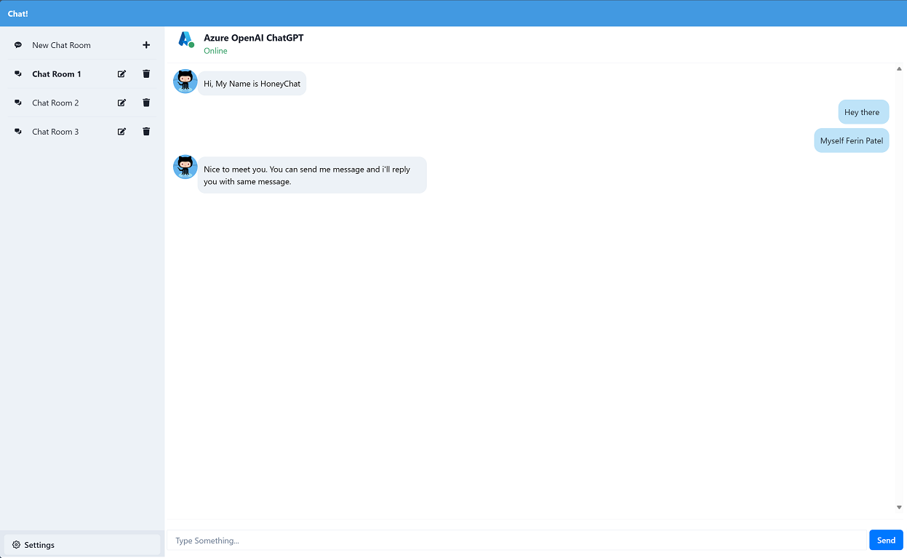

# Minimal chat user interface

## Begin Project 

### Start Next.js & Chakra UI

```bash
npx create-next-app@12 nextjs-chat --typescript
npm i @chakra-ui/react @emotion/react @emotion/styled framer-motion --save
cd nextjs-chat
npm run dev
```

```markdown
> npx create-next-app@12 nextjs-chat --typescript
√ Would you like to use ESLint with this project? ... **No** / Yes
√ Would you like to use Tailwind CSS with this project? ... No / **Yes**
√ Would you like to use `src/` directory with this project? ... **No** / Yes
√ Use App Router (recommended)? ... No / **Yes**
√ Would you like to customize the default import alias? ... **No** / Yes
```

### Hello! Next.js 

Access to `http://localhost:3000/chat`



---

This is a [Next.js](https://nextjs.org/) project bootstrapped with [`create-next-app`](https://github.com/vercel/next.js/tree/canary/packages/create-next-app).

## Getting Started

First, run the development server:

```bash
npm run dev
# or
yarn dev
```

Open [http://localhost:3000](http://localhost:3000) with your browser to see the result.

You can start editing the page by modifying `pages/index.tsx`. The page auto-updates as you edit the file.

[API routes](https://nextjs.org/docs/api-routes/introduction) can be accessed on [http://localhost:3000/api/hello](http://localhost:3000/api/hello). This endpoint can be edited in `pages/api/hello.ts`.

The `pages/api` directory is mapped to `/api/*`. Files in this directory are treated as [API routes](https://nextjs.org/docs/api-routes/introduction) instead of React pages.

## Learn More

To learn more about Next.js, take a look at the following resources:

- [Next.js Documentation](https://nextjs.org/docs) - learn about Next.js features and API.
- [Learn Next.js](https://nextjs.org/learn) - an interactive Next.js tutorial.

You can check out [the Next.js GitHub repository](https://github.com/vercel/next.js/) - your feedback and contributions are welcome!
